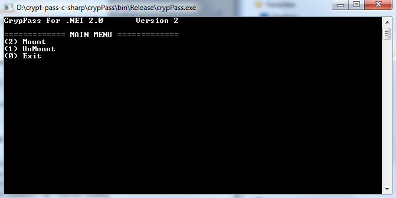

# Harddisc encrypter (programmed for private use)

# Features
 - Using truecrypt for mounting / encryption
 - Keylogger save!
 - Place bin/Release/* to an external USB device and use the USB device for mounting an encrypted harddisc!
 
